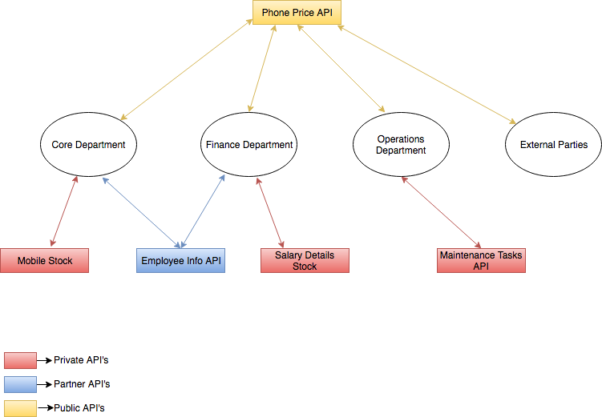
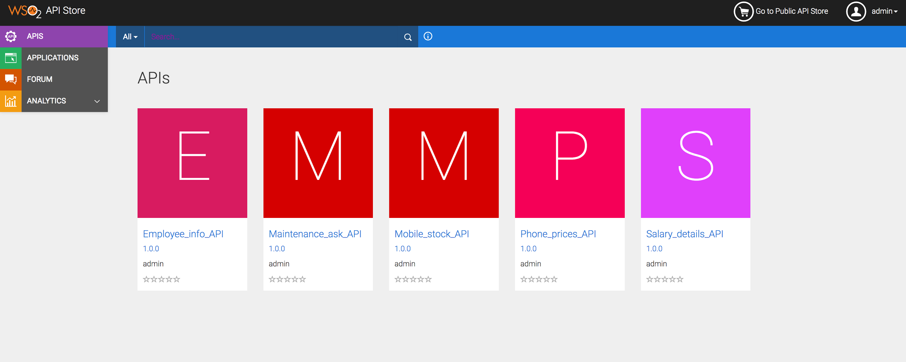

#Managing APIs

This sample scenario elaborates as to how you can manage public vs. partner vs. private APIs with WSO2 API Manager.

### Usecase

The following are the use cases with regard to managing public vs. partner vs. private APIs.

-   Ability to use some of the APIs internally.

-   Ability to share a subset of the internal APIs with partners.

-   As a result of the latter mentioned use case, it should facilitate the development of an API ecosystems with partners across industries (e.g., ability to book a hotel and a car as well at the time of booking a flight).

-   Connect with APIs that are owned by your partner

-   Enable partners to connect with your APIs

-   Expose some of the APIs as public APIs to expand the business operations.\
    Maintain a further subset of the APIs so that it can be exposed as public APIs. Many of the APIs that are used internally and with partners can be used as public APIs in order to drive additional business and help obtain new customers.

### Business Story

-   ABC organization is an organization that has separate departments for finance and operations other than their core business department which is mobile phone manufacturing.

-   The core business, finance, and operations departments are named `department_core` , `department_finance,` and `department_operations` respectively.

-   The finance department handles the salaries of employees. The core department is responsible for maintaining the mobile phone manufacturing stock. The operations department handles maintenance work of the organization.

Description of each API is as follows:

1.  `Employee_info_API` - Used by the core and finance departments.
2.  `Mobile_stock_API` - This API is used to get details of the current mobile stock details, and is used by the core department.
3.  `Salary_details_API` - This API is used to get details with regard to the salary of the employees, and is used by the finance department.
4.  `Maintenance_Task_API` - An API used to get maintenance tasks required for the day.

The following user cases are related to the above mentioned sample business scenario.

1.  The finance department (`deparment_finance)` needs to get the salary of each and every employee. This data is private to the finance department.

2.  The core department (`department_core)` needs to know the details about the stocks (e.g., the current stock price). This is private to the core department.

3.  The finance and core departments both need to know the details of the employees who are working in Core department. This data is only provided to the core and finance departments. The operations department should not be able to access the latter mentioned data.

4.  The core department (`department_core)` and the public need to know the current prices of the mobile phones.

5.  The operations department ( `department_operations`) needs to know the maintenance tasks required for the day.

6.  When a public user gets the details with regard to the price of a phone, which belongs to brand "A" and model "B", that same user should automatically shown the prices of the phone pouches that correspond to that relevant phone model. 

###Running the sample

Run the sample as follows to populate the sample data:

1.  Download the WSO2 API Manager sample scenarios.

2.  Unzip the sample-scenarios ZIP file and rename the unzipped folder to `sample-scenarios`.
3.  Copy the sample-scenarios folder to the `<API-M_HOME>` folder.
4.  Start the WSO2 API Manager Server.

5.  Go to `<API-M_HOME>/sample-scenarios` directory and execute the `run.sh` file. 

    |

    `./run.sh`

     |

6.  Enter the scenario number as 1, when prompted.

### User credentials

The following are the user credentials that you need to use when signing in to the WSO2 API Manager instance that has the sample data populated.

|User|Username|Password|
| --- | --- | --- |
|Finance department user| john@finance.abc.com | 123123 |
| Manufacturing department user | tom@core.abc.com | 123123 |
| Maintenance department user | bob@operations.abc.com | 123123 |

Created APIs looks like below screenshot

Created Tenants looks like below

Below screenshot show that user john can subscribe to the Salary_details_API since he belongs to the finance department.

Below screenshot show that john can see the api in his publisher view as well so that he can develop it.

Below screenshot show that John can not subscribe to Mobile_stock_API since he is not belongs to the core manufacturing department.

Below screenshot show that user Tom can subscribe to the Mobile_stock_API since he belongs to the core manufacturing department.

Below screenshot shows that Tom can develope the  Mobile_stock_API since he belongs to core manufacturing department.

Below two screenshots shows that both John and TOm can subscribe to Employee_info_API since both of them are are given privilege to access the Employee_info_API.

### References

[1] -[ https://docs.wso2.com/display/AM210/Key+Concepts#KeyConcepts-APIvisibilityandsubscription](https://docs.wso2.com/display/AM210/Key+Concepts#KeyConcepts-APIvisibilityandsubscription)

You can invoke and check the API’s giving results after subscribing to the relevant API’s and generating the keys.

