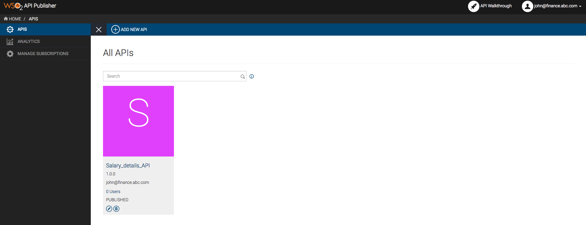
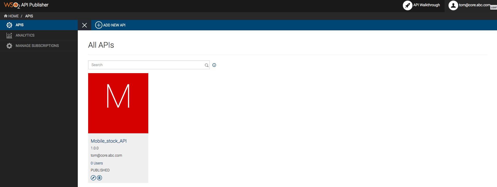

# API Development

## Ownership, permission and collaborative API development - Documentation

### Usecase

* Each business units are responsible for their APIs and data. Some of them having sensitive data. They need to consider security and controllability while providing value to the other business units.

* Able to restrict API (and its development) by business units

* Eg. APIs developed by financial business unit should be able to restrict (view/edit) to other business units

* Selected APIs should be able to share with different business units (edit and view)

### Business Story

* Let ABC organisation is an organisation that has separate departments for finance and operations other than their core business department which is mobile phone manufacturing(manufacturing department).

* Let the core business department be department_manufacturing while finance department be depratment_finance and operations department be department_operations.

* Let the finance department handle salaries of employees while manufacturing department is responsible to maintain the mobile phone manufacturing stock while operations department handles maintenance work of the organization

### Implement using WSO2 API Manager

We need to create

* Three different tenants(finance.abc.com, core.abc.com and operations.abc.com) for the three departments with users(John, Tom and Bob respectively) that can create APIs

* An API subscription only can be performed to the tenant relevant of finance department to get employee salary details. (Salary_details_API)

* An API subscription only can be performed to the tenant relevant of core department to get current mobile stock details. (Mobile_stock_API)

* An API subscription only can be performed to the tenant relevant of operations department to get required maintenance task for the day. (Maintenance_ask_API)

* An API subscription only visible to finance and manufacturing departments but restricted to operations departments to get the number of employees working in the core departments. (Employee_info_API)(*From this we can share/restrict the consumption of the API in store, But we can not share/restrict edit of the api in publisher. This has been identified as a GAP in API Manager 2.1.0)*

### Screenshots on how this can be seen in API Manager 2.1.0

Below screenshot show that user john can subscribe to the Salary_details_API since he belongs to the finance department.

Below screenshot show that john can see the api in his publisher view as well so that he can develop it.

Below screenshot show that John can not subscribe to Mobile_stock_API since he is not belongs to the core manufacturing department.

Below screenshot show that user Tom can subscribe to the Mobile_stock_API since he belongs to the core manufacturing department.

Below screenshot shows that Tom can develope the  Mobile_stock_API since he belongs to core manufacturing department.

Below two screenshots shows that both John and TOm can subscribe to Employee_info_API since both of them are are given privilege to access the Employee_info_API.

### How to run the sample to populate the above mentioned sample data

* Start wso2am-2.2.0-updateX is distribution by executing [APIM_HOME]/bin/wso2server.sh or [APIM_HOME]/bin/wso2server.bat

* Run the file run.sh in sample scenarios root directory[APIM_HOME/sample-scenarios] as ./run.sh

#### User credentials needed for login to API Manager instance.

##### Finance department user

Username: [john@finance.abc.com](mailto:john@finance.abc.com)

Password: 123123

##### Manufacturing department user

Username: [tom@core.abc.com](mailto:tom@core.abc.com)

Password: 123123

##### Maintenance department user

Username: [bob@operations.abc.com](mailto:bob@operations.abc.com)

Password: 123123

