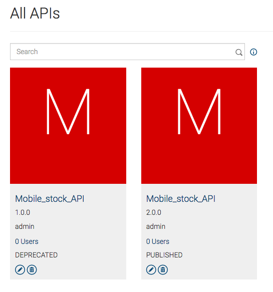

## API versioning

### Usecase

* Ability to retire old APIs and introduce new versions of APIs to enhance its functionality

* Ensure that API updates don’t break when upgraded/versioned or moved between environments, geographies, data centers and the cloud

* A/B testing with old vs new APIs

* Ability to notify consumers of the old version about the availability of the new API version

* Enforcing a grace period to upgrade to the new version of the API

Transferring contracts with app developers to newer versions.

### Business Story

API versioning is a key functionality that needs to be addressed once the users used to expose a specific API for a long time and when they need to add, remove or change the API’ in future. When doing this there may be uses who are using the old API. Hence while introducing the new API Old API should also be supported for a specific time period. That time period is offered basically because to guide the uses and give a period for them to switch to the new API. 

### Business Use Cases

* ABC company is a mobile phone manufacturing company. They have a requirement to publish mobile phone prices through an API.

* When the industry grows with the prices, they need to publish some additional data such as a rating, user reviews of the mobile phones, etc.

* Users of the old API should know that there is a new API version released, and they need to be notified.

### Implement using WSO2 API Manager

* We need an API to expose the mobile phone details of ABC company which will stand as the Old API

* We need to a new version of the above mentioned API to be state as the new API.

* We need the old API to be in published state and then once the new API version is created Old API should be in DEPRECATED state and the new versioned API should be in Published state.

* Subscribers of the Old API needs to get notified when the new API version is PUBLISHED.

Below are the screenshots that shows the OLD and New API’s with there lifecycle states.

Old API in DEPRECATED state

Old API in PUBLISHED state

 

**User can configure to get notifications for the newly created API version by following this documentation [1]**

### Running the sample

* Start the wso2am-2.5.0 distribution by executing [APIM_HOME]/bin/wso2server.sh or [APIM_HOME]/bin/wso2server.bat

* Run the file run.sh in sample scenarios root directory[APIM_HOME/sample-scenarios] as ./run.sh

### References

[1] - https://docs.wso2.com/display/AM250/Enabling+Notifications

